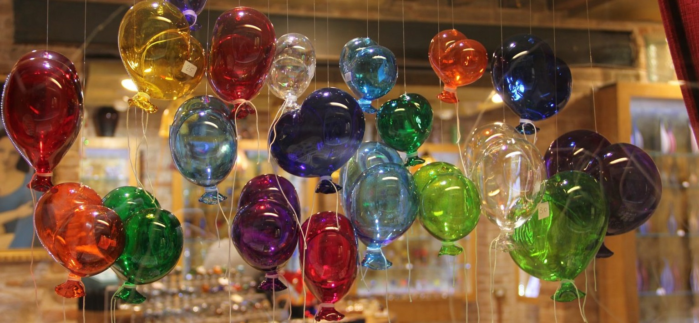

<h1 align="center">Hi 👋, I'm Pankaj</h1>

Please find my project repositories for,
1. (Machine Learning projects)[https://github.com/pnkjsyngh/MLProjects] completed as part of UT Austin Post Graduate Program in Machine Learning
2. Physics Informed Neural Network (PINN) to solve transient heat conduction problem
<!--
**pnkjsyngh/pnkjsyngh** is a ✨ _special_ ✨ repository because its `README.md` (this file) appears on your GitHub profile.

Here are some ideas to get you started:

- 🔭 I’m currently working on ...
- 🌱 I’m currently learning ...
- 👯 I’m looking to collaborate on ...
- 🤔 I’m looking for help with ...
- 💬 Ask me about ...
- 📫 How to reach me: ...
- 😄 Pronouns: ...
- ⚡ Fun fact: ...
-->
